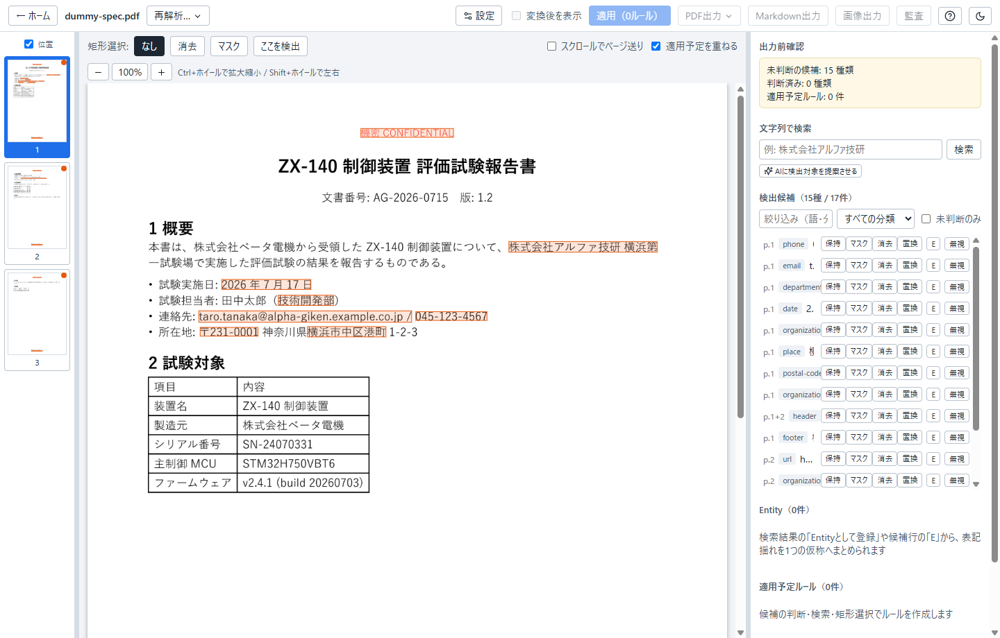
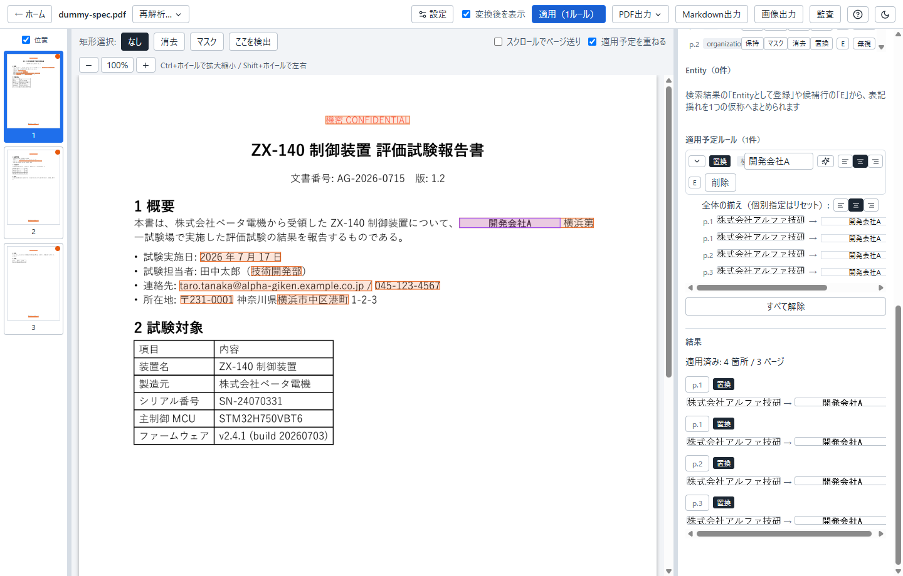

# Menreiki

**Preserve meaning. Replace identity.** — Local-first document de-identification, pseudonymization and generalization workbench.

Menreiki detects identifying information in PDFs and images — names, organizations, product and model numbers, locations, reference numbers — entirely on your machine, and lets a human reviewer remove, mask, pseudonymize, or generalize it. Spelling variants of the same subject are unified under one consistent alias, so the derived document keeps its meaning and relationships while the original subjects become unidentifiable.

> **Status: beta, Windows only.** Detection is not exhaustive and a passing audit means the configured checks passed — it is not a guarantee of absolute safety. A human must always make the final release decision. See [docs/QUALITY.jp.md](docs/QUALITY.jp.md) for the quality model and responsibility boundaries, and [docs/PRIVACY.md](docs/PRIVACY.md) for the privacy policy (nothing is collected).

## Highlights

- **Local-first** — analysis, OCR, transformation, and auditing all run locally; the app makes no network connections. Optional LLM assistance connects to a localhost-only OpenAI-compatible endpoint.
- **Safe output** — the sanitized PDF and Markdown are rebuilt from transformed page pixels alone, so text layers, metadata, annotations, and attachments of the source can never leak into them.
- **Review workbench** — a three-pane GUI with detected candidates overlaid on page images, entity management for spelling variants, region selection across pages, and a re-OCR audit that reports any residual identifying text.

## Documentation

The full documentation is currently in Japanese — see **[README.jp.md](docs/README.jp.md)** for setup, CLI usage, and testing, and [docs/PRD.jp.md](docs/PRD.jp.md) for the product requirements.

An English version of the documentation is planned but not yet written. Until then, the Japanese README is the authoritative reference.

## License

Licensed under either of

- MIT License ([LICENSE-MIT](LICENSE-MIT))
- Apache License, Version 2.0 ([LICENSE-APACHE](LICENSE-APACHE))

at your option. Unless you explicitly state otherwise, any contribution intentionally submitted for inclusion in the work by you shall be dual licensed as above, without any additional terms or conditions.
